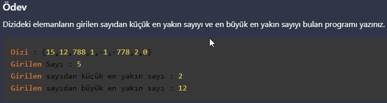

# PatikaJavaPractice20
```
Program to find the closest number smaller than the entered number of the elements 
in the array and the closest number larger than the entered number
```
```
Dizideki elemanların girilen sayıdan küçük en yakın sayı ile 
büyük en yakın sayıyı bulan program.
```

[Patika](https://www.patika.dev)

Dizide sayı bulma
